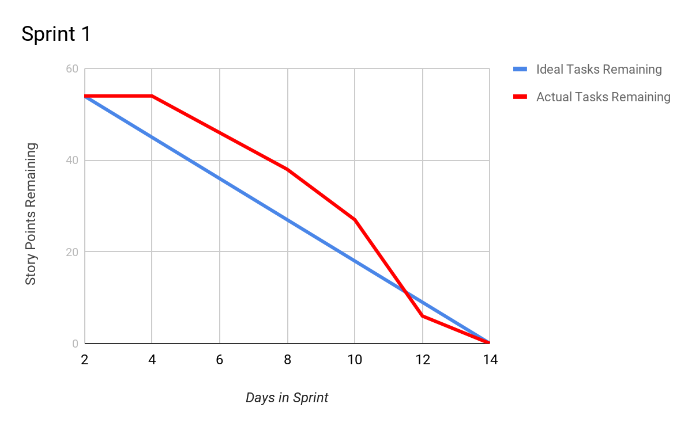
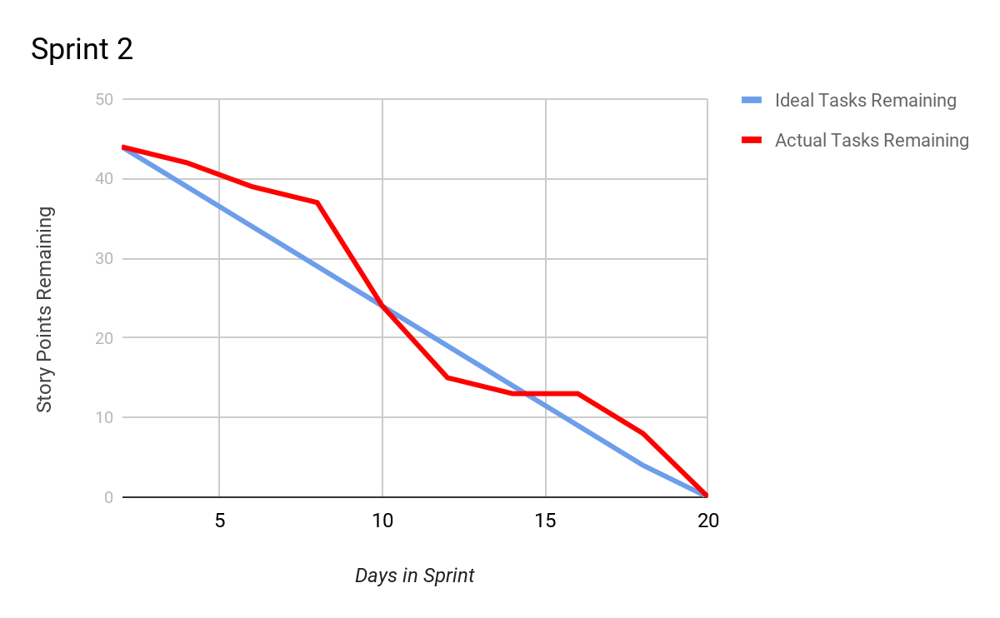

# Sprint 1
## Accomplishments
- Created React App
- Set up Firebase
- Created Navigation Bar Component
- Created Home Page and Signup/SignIn Page

## Things to Improve On:
-Figmas for new upcoming pages  
-Make Styling consistent  
-Make Pull Requests  

## PostSprint Goals:
-Update profile pic  
-Create Profile Page  
-Add settings under profile  

# Sprint 2
## Accomplishments
- Responsive Sizing for Components
- Functionality completion for interactive button components
- Created the Group Page
- Discussed in meetings on plans for future implementations
- Ability to create and delete group
- Search and add members to group
## Things to Improve On:
- Consistent updating of the Trello Scrum Sheet
## PostSprint Goals:
- Change username  
- Add bill functionality  
- Verify Bills
- Establish Group Owner privileges
- Display payment history
- Display total amount spent

# Sprint 3
## Accomplishments
- Group Owner vs Group Member privileges
- Delete member from group
- Create Bills and divide total payment
- Payment status functionality and display
- Dashboard displays current bill from Group member
- Security Rules implemented
- Posting Bills to members connected through database
## PostSprint Goals:
- Update LatePayment History Graph
- Individual Rent Amount for Each Group Member
- Reset password

